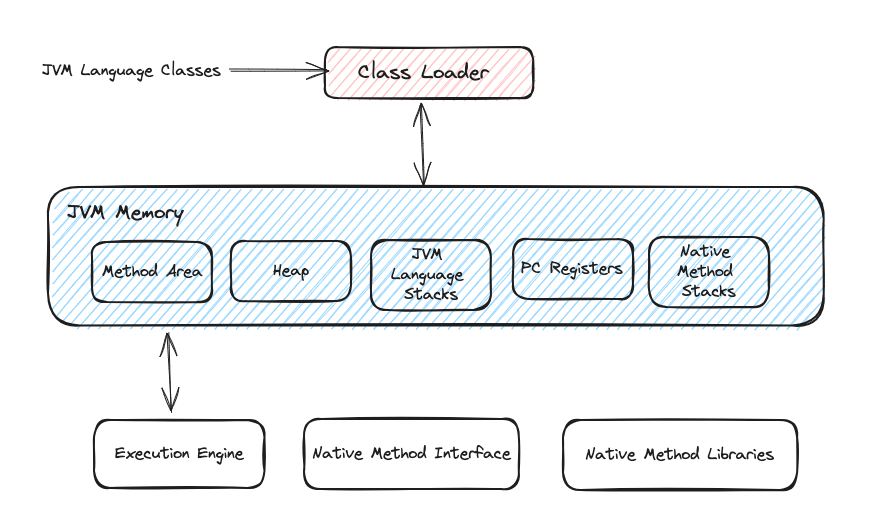

### What is JVM?
 - "Java Virtual Machine"
 - Basically JVM provides runtime environment in which Java programs are executed. First the java programs get compiled and converted into byte code. JVM is responsible for loading Class files and executing that byte code.

### Is JVM, a compiler or interpreter?
 - The JVM (Java Virtual Machine) is both a compiler and an interpreter.

### What is Classloader?
 - Class loader is a set of components which loads the classes during runtime into JVM.
 - These classes are not loaded all at once, when the application requires that particular class or we can say when we try to use a Class, Java ClassLoader loads that class into memory.

### What are the various memory areas present in JVM?
 - JVM has 5 different memory areas :
    1. Method area (**Method Area (PermGen or Metaspace): The method area stores class structures, method data, and static variables. In Java 8 and later versions, PermGen has been replaced by Metaspace.**)
    2. Stack area
    3. Heap area
    4. PC Registers
    5. Native method area
  
### Which memory area is used to store static variables?
 - JVM stores the Class level information in the Method area. Class level information consists Class name, parent Class name, Method info, Variables info, Constructors, Modifiers info, Constant pool info etc.

### When are the static variables loaded in memory?
 - Static variables get loaded at the time of class loading and gets stored in the method area.

### What is Heap space in Java?
 - Heap memory in JVM is used to store objects and corresponding instance variables.
    1. Whenever we create objects, it is always created in Heap space.
    2. Heap area gets created when we start JVM
    3. Heap area is shared among all the threads. Method and heap area need not be continuous.

### What is Stack? What it stores?
 - Stack is a part of memory that stores each method call performed by that thread including primitives and local variables.
 - For every thread, a new runtime stack gets created.

### What happens when there is not enough Heap Space for storing new objects?
 - JVM tries to free up space but if it fails then JVM throws java.lang.OutOfMemoryError.
